# Cascadia OS

> **The execution layer for AI operators that actually finish the work.**

---

I was five years old the first time I took apart a telephone. Not for school. Because I needed to understand how the sound got through the wire.

Before I built AI operators, I built machines that could not be allowed to fail.

Decades later — after aerospace engineering, industrial automation, large-scale warehouse and government infrastructure work, and building always-on systems under real heat, cost, and security constraints — I kept running into the same problem: AI that looked impressive in demos and became unreliable the moment it touched real work.

I didn't want a chatbot. I wanted an operator I could trust. Something that remembers, asks before acting, resumes after failure, and stays bounded when the stakes are real.

**That's what this is.** → [Full story](./STORY.md)

---

## Why this is different

- **Durable by design** — resumes from committed state after failure
- **Human-controlled** — approval gates block risky actions until explicitly approved
- **Local-first economics** — useful on local hardware, with cloud used only when it is worth it
- **Cloud-optional** — runs locally first, with external models as a choice rather than a requirement

---

## ⚡ One-Command Install

```bash
curl -fsSL https://raw.githubusercontent.com/zyrconlabs/cascadia-os/main/install.sh | bash
```

Installs Homebrew (if needed), SwiftBar, Cascadia OS, registers a login agent, and links the menu bar controller. Everything starts automatically at boot. No manual steps.

> **Requires:** Python 3.11+ and git. Everything else is handled automatically.

→ [Full quickstart guide](./QUICKSTART.md)

**Windows:**

    git clone https://github.com/zyrconlabs/cascadia-os.git
    powershell -ExecutionPolicy Bypass -File cascadia-os\windows\install.ps1

→ [Windows installation guide](./windows/README.md)

---

## 🎬 Run the Demo

After installing, run the demo — ~90 seconds end-to-end:

```bash
bash demo.sh
```

**What you'll see:**
1. Lead arrives → workflow starts automatically
2. System classifies, enriches, drafts a response
3. Approval gate fires — email held until a human approves
4. **System crashes mid-run** (deliberate)
5. Restarts — resumes from exact same step, zero duplication
6. Approval given → email sent → CRM logged → complete

---

## See it working

Built-in screenshots and terminal captures live in [`assets/`](./assets/).

**One command installs everything:**


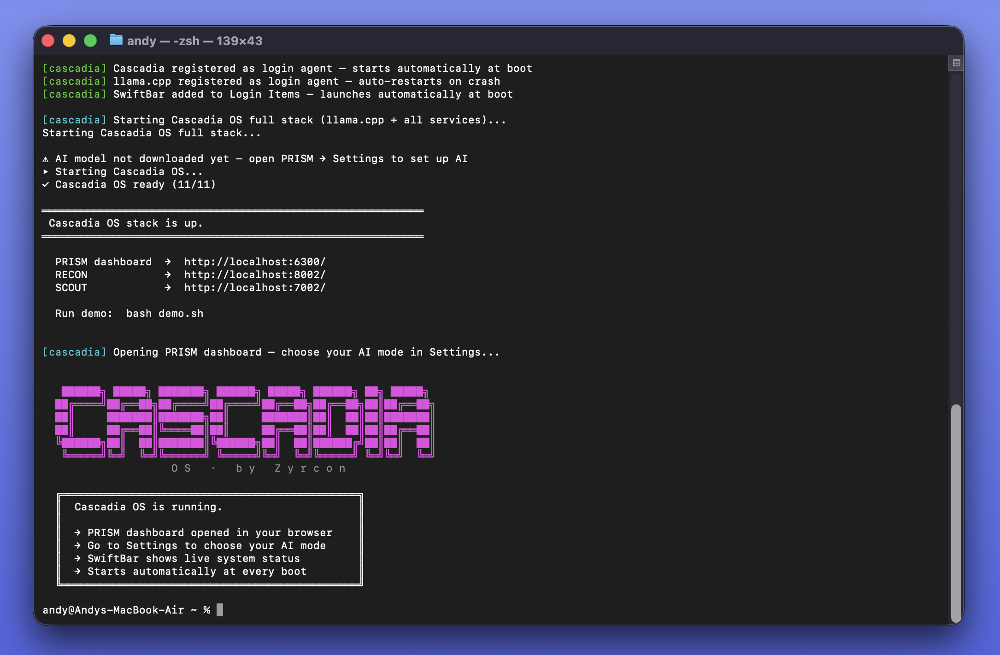

**PRISM dashboard and system setup:**


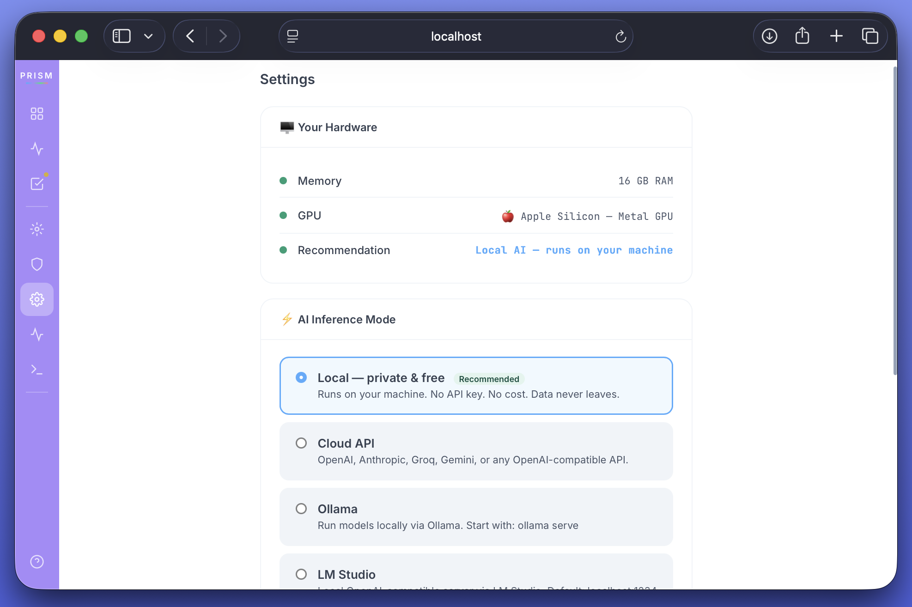

**Health, observability, and approvals:**

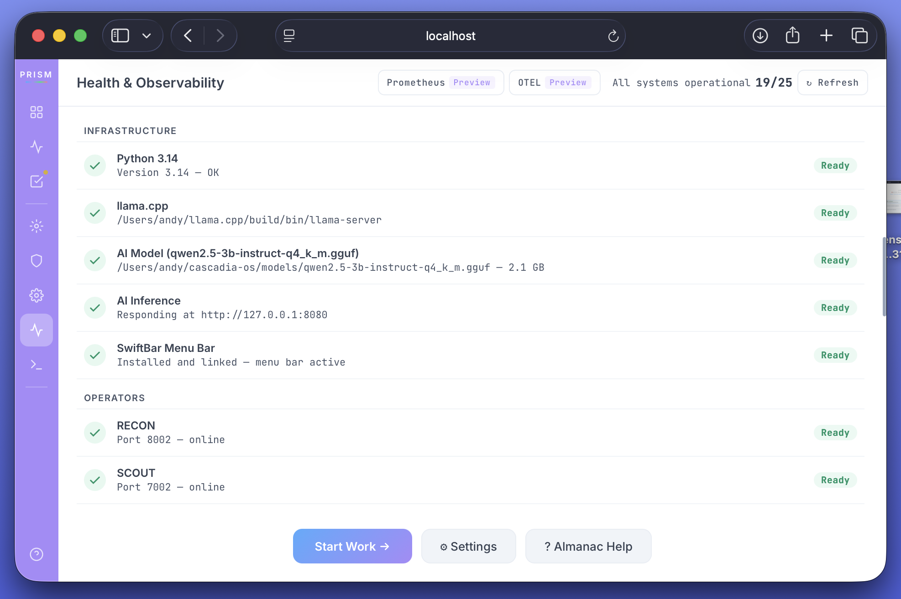
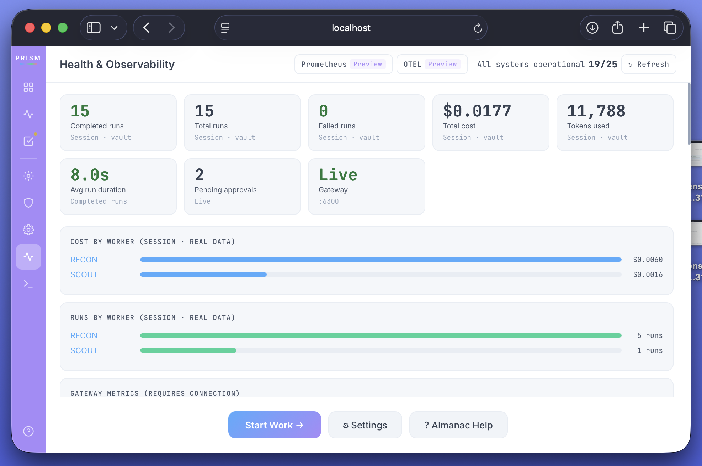
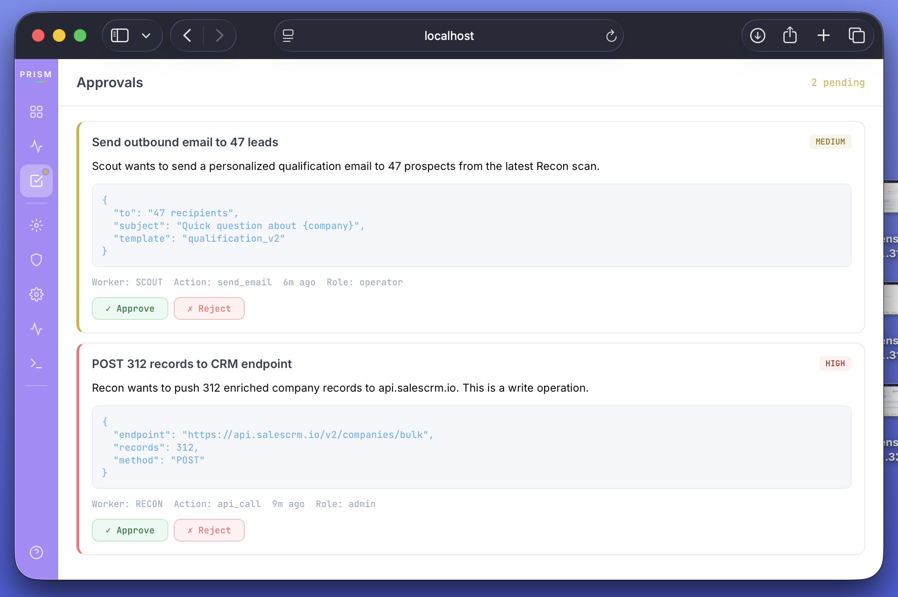

**Operators in action:**

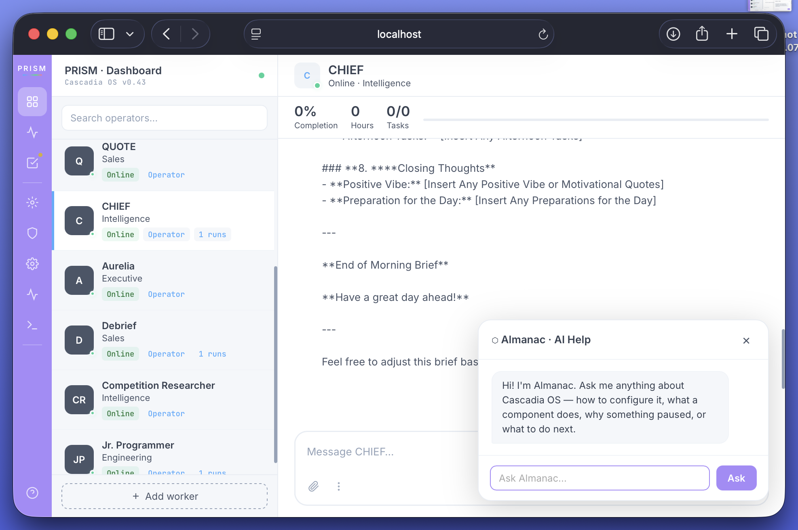
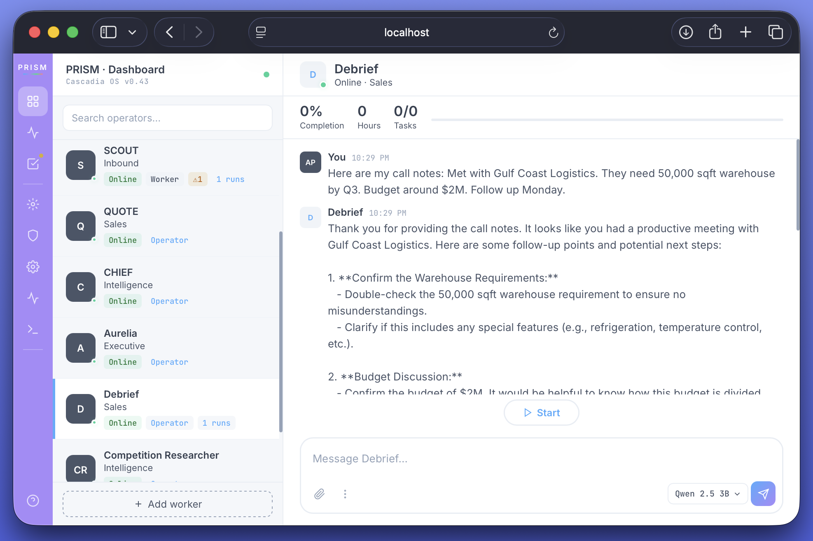
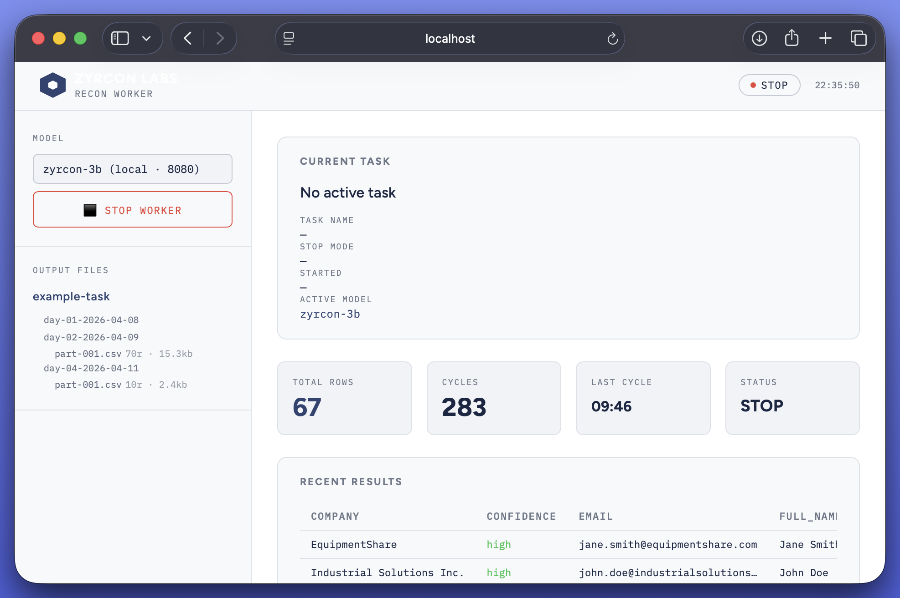

**Crash recovery and durability:**

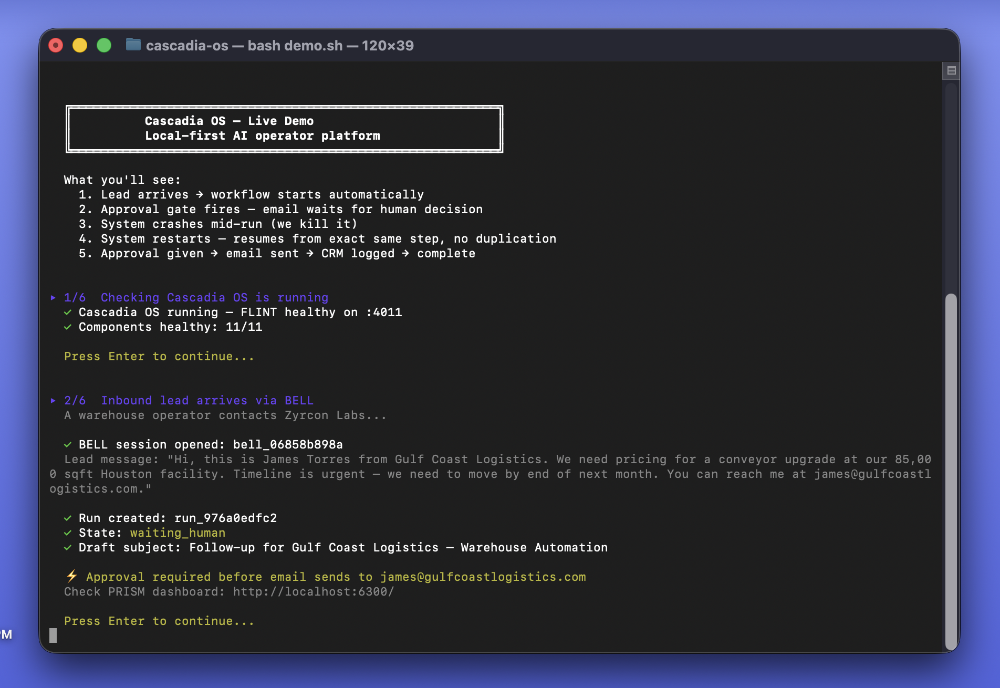

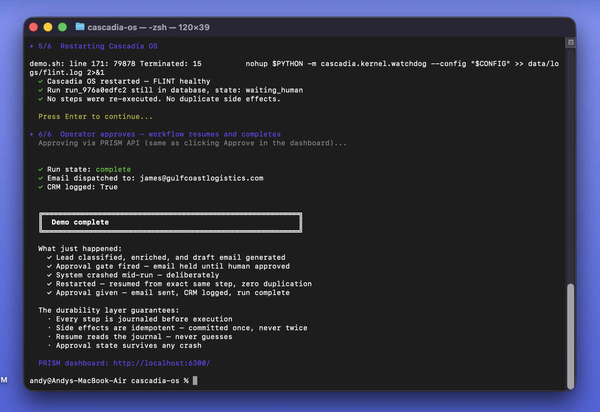

**Kernel and local inference:**


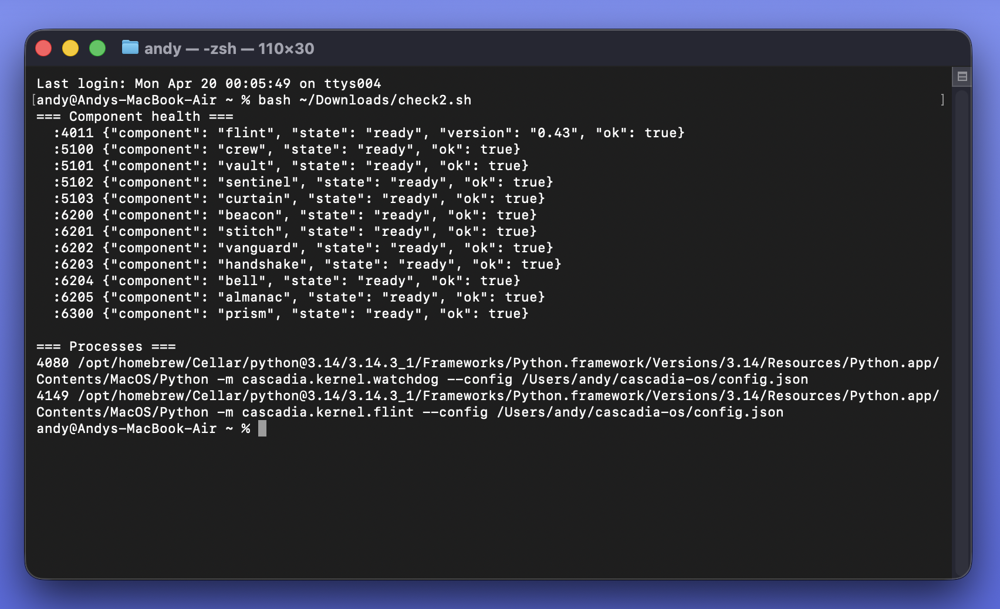
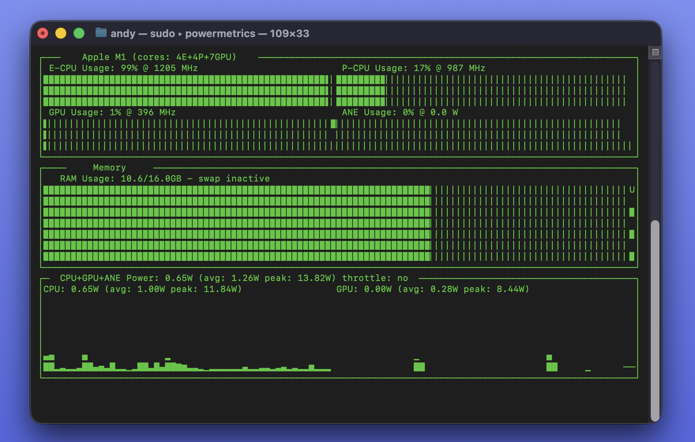

---

## Asset library

All built-in assets currently in the repo:

| Asset | What it shows |
|---|---|
| [`assets/install.png`](./assets/install.png) | Fresh installer run from terminal |
| [`assets/install_complete.png`](./assets/install_complete.png) | Full stack started, PRISM opened, boot automation confirmed |
| [`assets/prism.png`](./assets/prism.png) | Main PRISM dashboard with operators online |
| [`assets/settings.png`](./assets/settings.png) | Hardware detection and AI mode selection |
| [`assets/health.png`](./assets/health.png) | Health & observability page for infrastructure and operators |
| [`assets/observability.png`](./assets/observability.png) | Session metrics, cost, token usage, run counts |
| [`assets/approvals.png`](./assets/approvals.png) | Approval gate UI with medium/high-risk actions |
| [`assets/chief.png`](./assets/chief.png) | CHIEF view with Almanac help pane |
| [`assets/debrief.png`](./assets/debrief.png) | Debrief operator extracting next steps from call notes |
| [`assets/recon_dashboard.png`](./assets/recon_dashboard.png) | RECON worker dashboard with rows, cycles, and recent results |
| [`assets/demo_start.png`](./assets/demo_start.png) | Demo starts, inbound lead arrives, approval gate fires |
| [`assets/crash_recovery.png`](./assets/crash_recovery.png) | Deliberate mid-run crash followed by correct resume behavior |
| [`assets/demo_complete.png`](./assets/demo_complete.png) | Demo completes with approval, email dispatch, and CRM log |
| [`assets/watchdog.png`](./assets/watchdog.png) | Full stack startup with services and ports |
| [`assets/watchdog2.png`](./assets/watchdog2.png) | Menu bar control and PRISM quick actions |
| [`assets/kernel_health.png`](./assets/kernel_health.png) | Direct component health and FLINT/watchdog process view |
| [`assets/gpu_inference.png`](./assets/gpu_inference.png) | Local Apple Silicon inference and power usage |

---

## Real operator outputs

These sample outputs were generated on a MacBook Air M1 using a local Qwen 3B backend. No cloud API required.

| Output | What it shows |
|---|---|
| [Houston warehouse leads](./samples/recon-houston-warehouse-leads-2026-04-18.csv) | RECON — 25+ search cycles, hallucination-filtered |
| [GC Logistics proposal](./samples/proposal-GC-Logistics-2026-04-18.md) | Full proposal from one-paragraph RFQ in 30 seconds |
| [Morning brief](./samples/chief-brief-2026-04-18.md) | CHIEF — 90-second executive brief from live operator data |
| [Post-call debrief](./samples/debrief-gc-logistics-2026-04-18.md) | Action items and follow-up draft from raw call notes |

---

## What it does

Cascadia OS coordinates AI operators that:

- **Remember** — context, decisions, and state persist across sessions and crashes
- **Ask** — approval gates block risky actions until a human says yes
- **Never duplicate** — idempotency enforced at the database layer, not by hope
- **Recover** — resume from the last committed step, not from scratch
- **Run supervised** — FLINT watches every process; the watchdog watches FLINT

---

## Architecture

### Control plane
| Module | What it does |
|---|---|
| FLINT | Process supervision, tiered startup, health polling, restart/backoff |
| Watchdog | External FLINT liveness monitor — lives outside the supervision tree |

### Durability layer
| Module | What it does |
|---|---|
| VAULT | SQLite-backed memory, context and state across sessions and crashes |
| CURTAIN | AES-256-GCM field encryption, HMAC-SHA256 envelope signing |

### Named components
| Name | Port | What it does |
|---|---:|---|
| CREW | 5100 | Operator registry with wildcard capability validation |
| VAULT | 5101 | Durable SQLite-backed memory, CREW-validated access |
| SENTINEL | 5102 | Risk classification, blocks denied actions in execution loop |
| CURTAIN | 5103 | AES-256-GCM field encryption, HMAC-SHA256 signing |
| BEACON | 6200 | Capability-checked routing, HTTP forwarding to operator ports |
| STITCH | 6201 | Workflow sequencing with built-in templates |
| VANGUARD | 6202 | Inbound channel normalization, outbound dispatch via HANDSHAKE |
| HANDSHAKE | 6203 | Webhook/HTTP/SMTP execution, external API registry |
| BELL | 6204 | Chat sessions, workflow execution, approval collection |
| ALMANAC | 6205 | Component catalog, glossary, runbooks |
| PRISM | 6300 | Live system visibility — runs, approvals, operators |

---

## Reliability guarantees

Tested in `tests/test_crash_recovery.py`. Not just claimed.

| Scenario | Behavior |
|---|---|
| Kill operator mid-run | Resumes from last committed step, not step 0 |
| Crash after side effect declared but not committed | Re-attempts on resume |
| Crash after side effect committed | Skips — never duplicates |
| Approval-required run restarted | Stays `waiting_human`, never auto-resumes |
| Multiple crashes in sequence | `retry_count` increments correctly each time |

---

## PRISM Dashboard

Open `http://localhost:6300/` while Cascadia is running.

**Surfaces:** Live operator status · Run timeline · Approvals · Observability · Studio · Admin

**API:**
```bash
GET  :6300/api/prism/overview    # Full system snapshot
GET  :6300/api/prism/runs        # Live run states
GET  :6300/api/prism/approvals   # Pending human decisions
POST :6300/api/prism/approve     # Approve or deny a gated action
GET  :6300/api/prism/crew        # Active operators
```

Full documentation: [PRISM_MANUAL.md](./PRISM_MANUAL.md)

---

## Operators

| Operator | Category | Status | What it does |
|---|---|---|---|
| RECON | Intelligence | Production | Autonomous web research, extracts contacts to CSV |
| SCOUT | Inbound | Production | Chat widget, qualifies leads, routes to workflow |
| QUOTE | Sales | Beta | RFQ to proposal in under 5 minutes |
| CHIEF | Intelligence | Beta | Daily brief synthesizing all operators |
| Aurelia | Executive | Beta | EA — commitments, priorities, weekly CEO report |
| Debrief | Sales | Beta | Post-call logger — action items, follow-up drafts |

Operator registry: [cascadia/operators/registry.json](./cascadia/operators/registry.json)

---

## Design rules

1. FLINT supervises. FLINT does not execute workflows.
2. No side effect executes twice. Idempotency is enforced at the DB layer.
3. Resume reads the journal. Resume does not guess.
4. Dangerous actions require policy clearance. Policy is separate from capability.
5. Blocking a run is explicit. Auto-resuming a blocked run is never allowed.
6. The module that owns execution does not own policy. The module that owns policy does not own storage.

---

## Docs

- [Quickstart](./QUICKSTART.md)
- [Windows Installation](./windows/README.md)
- [Manual](./MANUAL.md)
- [PRISM Manual](./PRISM_MANUAL.md)
- [Contributing](./CONTRIBUTING.md)
- [Security Policy](./SECURITY.md)
- [Story behind the project](./STORY.md)

---


---

## Licence

Cascadia OS core is licensed under the **Apache License 2.0**.
See [LICENSE](./LICENSE) for full terms.

Certain components — including first-party pre-built business
operators, hardware appliance images, Cascadia Pro, managed cloud
services, marketplace infrastructure, and enterprise support —
are offered under separate commercial terms. See
[LICENSING.md](./LICENSING.md) and [COMMERCIAL.md](./COMMERCIAL.md)
for the full breakdown, or contact zyrconlabs@gmail.com for
commercial inquiries.

**Dependencies:** llama.cpp (MIT) · Qwen3 (Apache 2.0)

---

*Built in Houston, Texas — [Zyrcon Labs](https://github.com/zyrconlabs)*
