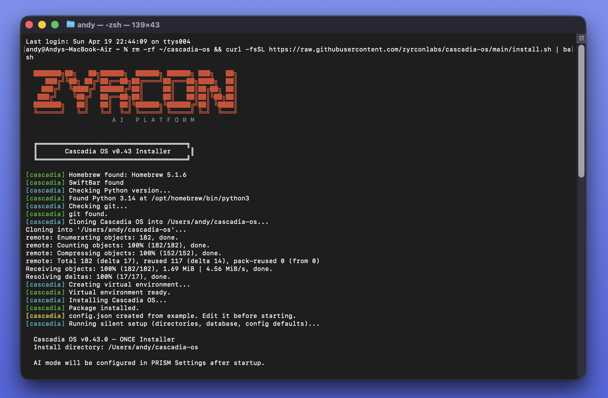
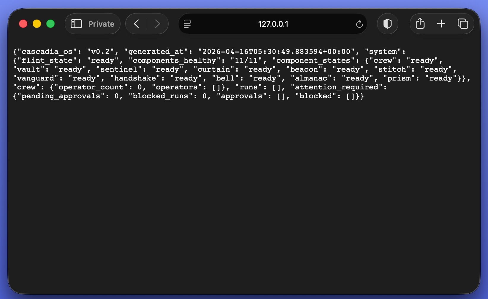
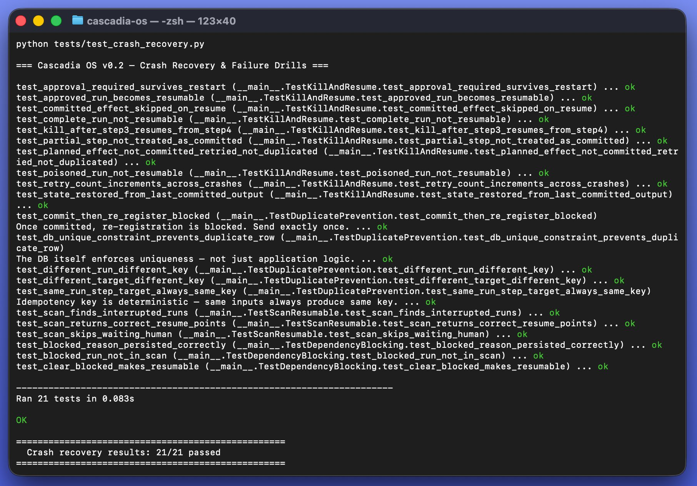

# Cascadia OS

> **The execution layer for AI operators that actually finish the work.**

---

I was five years old the first time I took apart a telephone. Not for school. Because I needed to understand how the sound got through the wire.

Decades later — aerospace engineering in Moscow, automation projects for Amazon and the US Navy, building at 2am while my daughter slept — I kept running into the same problem: AI that was impressive in demos and unreliable in production.

I didn't want a chatbot. I wanted an operator I could trust. Something that remembers, asks before acting, and picks up where it left off after a crash. Something designed for the moment when things go wrong at three in the morning and nobody is watching.

**That's what this is.** → [Full story](https://github.com/Zyrconlabs/cascadia-os/blob/main/STORY.md)

---

## See it working

**One-click install — done in under a minute:**


**Watchdog running — all 11 components healthy:**


**PRISM dashboard — live system status:**


**Crash recovery — 21/21 tests passed:**


---

Most AI tools are impressive in demos. They forget context, act without guardrails, and collapse when a workflow spans more than one session.

Cascadia OS is built to a different standard — durable enough to survive crashes, supervised enough to ask before taking sensitive actions, and honest enough to tell you exactly what it can and can't do.

---

## ⚡ One-Click Install

**Mac / Linux:**
```bash
curl -fsSL https://raw.githubusercontent.com/Zyrconlabs/cascadia-os/main/install.sh | bash
```

**Windows** — in PowerShell:
```powershell
irm https://raw.githubusercontent.com/Zyrconlabs/cascadia-os/main/install.bat -OutFile install.bat; .\install.bat
```

> **Requires:** Python 3.11+ and git

The installer clones the repo, creates a virtual environment, installs the package, copies your config, runs first-time setup, and adds a `cascadia` launcher to your PATH.

---

## Manual Start

```bash
# First-time setup
python -m cascadia.installer.once          # Opens browser setup wizard at http://127.0.0.1:18780
python -m cascadia.installer.once --no-browser  # Terminal fallback

# Start the OS (watchdog keeps FLINT alive)
python -m cascadia.kernel.watchdog --config config.json

# Run all tests
python -m unittest discover -s tests -v

# Run crash and recovery drills
python tests/test_crash_recovery.py
```

---

## What it does

Cascadia OS coordinates AI operators that:

- **Remember** — context, decisions, and state persist across sessions and crashes
- **Ask** — approval gates block risky actions until a human says yes
- **Never duplicate** — idempotency enforced at the database layer, not by hope
- **Recover** — resume from the last committed step, not from scratch
- **Run supervised** — FLINT watches every process; the watchdog watches FLINT

---

## What is working right now

### Control plane
| Module | What it does |
|---|---|
| FLINT `kernel/flint.py` | Process supervision, tiered startup, health polling, restart/backoff, graceful shutdown |
| Watchdog `kernel/watchdog.py` | External FLINT liveness monitor — lives outside the supervision tree |

### Durability layer
| Module | What it does |
|---|---|
| run_store | Durable run records with process_state + run_state split |
| step_journal | Append-only step log — source of truth for resume |
| resume_manager | Safe resume-point calculation from committed steps |
| idempotency | SHA-256 keyed side effect records, UNIQUE DB constraint |
| migration | Idempotent schema migration, handles legacy DB upgrades |

### Policy and approvals
| Module | What it does |
|---|---|
| runtime_policy | allow / deny / approval_required per action type |
| approval_store | Persists approval requests and decisions, wakes blocked runs |
| dependency_manager | Detects missing operators and permissions, writes blocked state |

### Named components
| Name | What it does |
|---|---|
| CREW | Operator group registry with wildcard capability validation |
| VAULT | Durable SQLite-backed memory, capability-gated |
| SENTINEL | Risk classification: low / medium / high / critical per action |
| CURTAIN | HMAC-SHA256 envelope signing and field encryption (stdlib only) |
| BEACON | Capability-checked routing and operator handoffs |
| STITCH | Workflow sequencing with built-in templates |
| VANGUARD | Inbound channel normalization, outbound dispatch |
| HANDSHAKE | External API connection registry |
| BELL | Chat sessions and approval response collection |
| ALMANAC | Component catalog, glossary, runbooks |
| PRISM | Aggregated system visibility — runs, approvals, blocked, crew |

---

## Reliability guarantees — proven by crash tests

These are tested in `tests/test_crash_recovery.py`. Not just claimed.

| Scenario | Behavior |
|---|---|
| Kill operator mid-run | Resumes from last committed step, not step 0 |
| Crash after side effect declared but not committed | Re-attempts the effect on resume |
| Crash after side effect committed | Skips the effect — never duplicates |
| Approval-required run restarted | Stays `waiting_human`, never auto-resumes |
| Poisoned or complete run | Never resumed under any condition |
| Multiple crashes in sequence | `retry_count` increments correctly each time |

---

## What is partial in v0.2

Present and registered, but not fully wired end-to-end yet:

- **SENTINEL** — risk rules work; enforcement hooks into the full operator execution loop are v0.3
- **CURTAIN** — HMAC signing works; AES-256-GCM and asymmetric key exchange are v0.3
- **HANDSHAKE** — connection registry works; actual HTTP execution to external APIs is v0.3
- **VANGUARD** — normalization works; real channel adapters (SMTP, SMS) are v0.3

---

## Roadmap

- GRID — decentralized compute network
- DEPOT — operator marketplace
- Scheduler and trigger manager
- MicroVM operator isolation
- Multi-node HA

---

## PRISM dashboard

PRISM is the browser-based visibility layer for Cascadia OS. Open `cascadia/dashboard/prism.html` in any browser while Cascadia is running — no build step, no server, no dependencies.

**Features:** Live component status for all 11 services, run timeline with event replay, observability metrics, human approval flow, drag-and-drop Studio, and Admin/audit log. Full documentation in [PRISM_MANUAL.md](./PRISM_MANUAL.md).

**PRISM API** (served by the PRISM component at `:6300`):

```bash
GET  http://127.0.0.1:6300/api/prism/overview    # Full system snapshot
GET  http://127.0.0.1:6300/api/prism/system      # FLINT component states
GET  http://127.0.0.1:6300/api/prism/runs        # Recent run states
GET  http://127.0.0.1:6300/api/prism/approvals   # Pending human decisions
GET  http://127.0.0.1:6300/api/prism/blocked     # Runs blocked on dependencies
GET  http://127.0.0.1:6300/api/prism/crew        # Active operators
GET  http://127.0.0.1:6300/api/prism/workflows   # STITCH workflows
POST http://127.0.0.1:6300/api/prism/run         # {run_id} → full run detail
```

---

## Design rules

1. FLINT supervises. FLINT does not execute workflows.
2. No side effect executes twice. Idempotency is enforced at the DB layer.
3. Resume reads the journal. Resume does not guess.
4. Dangerous actions require policy clearance. Policy is separate from capability.
5. Blocking a run is explicit. Auto-resuming a blocked run is never allowed.
6. The module that owns execution does not own policy. The module that owns policy does not own storage.

---

## Why this exists

I was five years old the first time I took apart a telephone. Not for school. Because I needed to understand how the sound got through the wire.

Decades later — aerospace engineering in Moscow, automation projects for Amazon and the US Navy, building things at 2am while my daughter slept — I kept running into the same problem: AI that was impressive in demos and unreliable in production.

I didn't want a chatbot. I wanted an operator I could trust. Something that remembers, asks before acting, and picks up where it left off after a crash. Something designed for the moment when things go wrong at three in the morning and nobody is watching.

That's what this is.

→ [Full story](https://github.com/Zyrconlabs/cascadia-os/blob/main/STORY.md)

---

## Docs

- [Contributing](./CONTRIBUTING.md)
- [Security Policy](./SECURITY.md)
- [Support](./SUPPORT.md)
- [Story behind the project](https://github.com/Zyrconlabs/cascadia-os/blob/main/STORY.md)

---

*Built in Houston, Texas — [Zyrcon Labs](https://github.com/zyrconlabs)*
